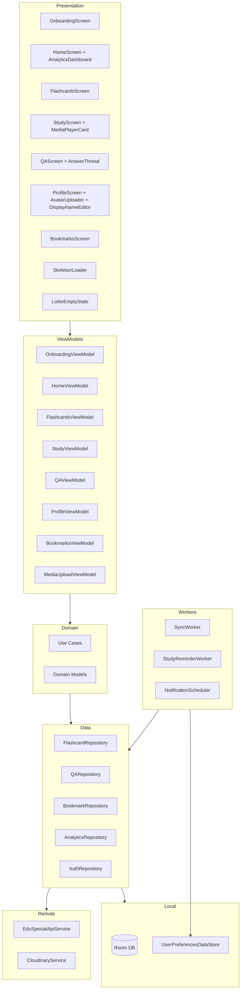
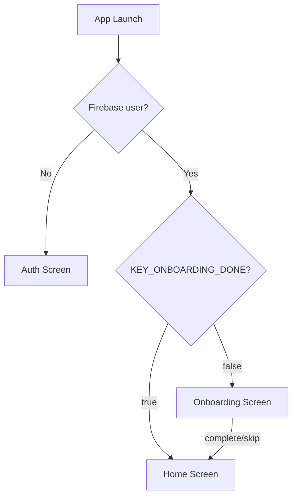
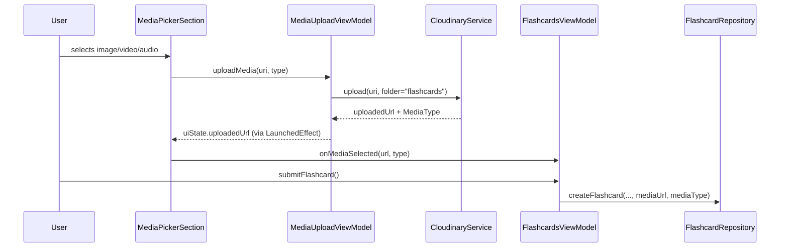
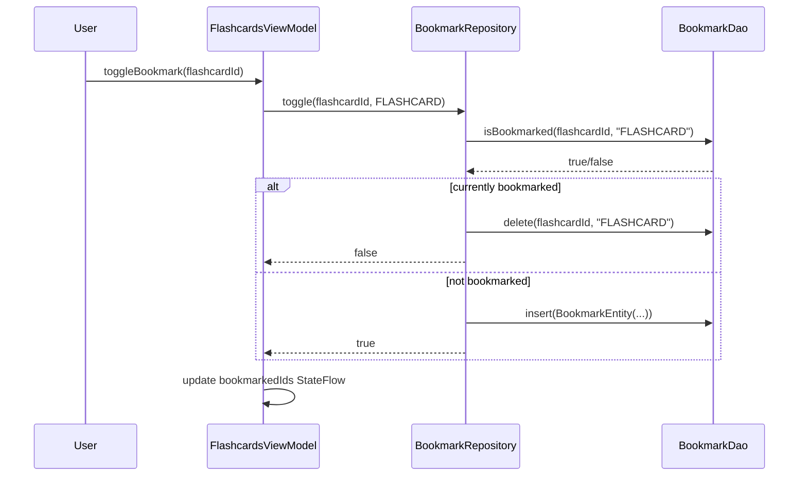
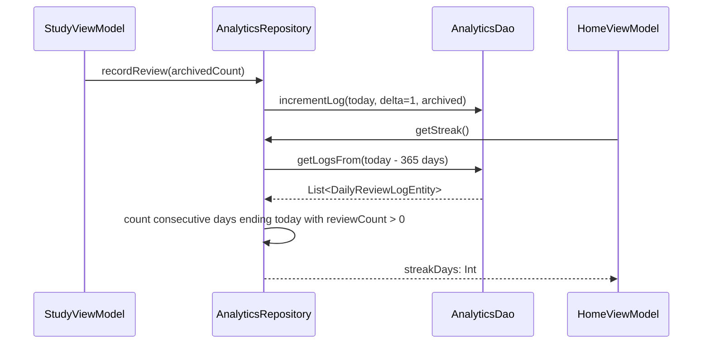
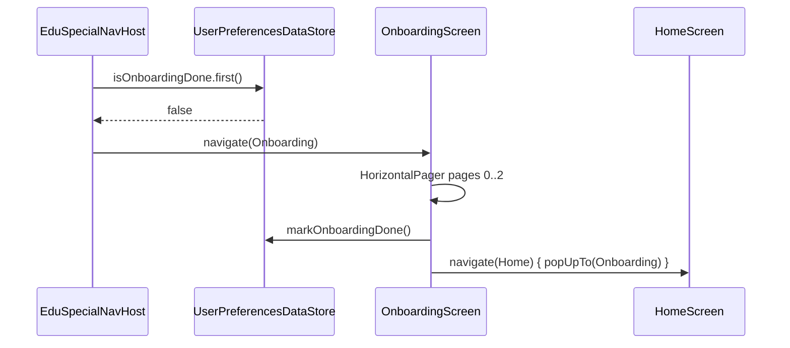

# Design Document — EduSpecial App Completion

## Overview

EduSpecial is an Arabic-first Android application serving as an ABA therapy and special education encyclopedia. The app is ~85% complete. This design document covers the technical architecture for completing the remaining 15%: media upload wiring, content editing, answer management, avatar upload, background sync enhancements, study reminder notifications, analytics dashboard, bookmarks, profile customization, onboarding flow, and comprehensive UI polish.

### Design Goals

- **Offline-first**: All new features follow the existing Room → Repository → ViewModel pattern; network calls are best-effort with local fallback.
- **Arabic-first / RTL**: All new UI enforces RTL layout direction and Arabic strings.
- **Minimal new dependencies**: Reuse ExoPlayer, Lottie, Coil, WorkManager, and Material 3 already in the project.
- **Testability**: Pure business logic (streak calculation, bookmark toggle, display name validation, sync idempotence) is isolated in use cases and repositories for property-based testing.

---

## Architecture

The app follows a clean-architecture layered structure. The diagram below shows how the new components fit into the existing layers.



### Key Architectural Decisions

1. **`AnalyticsRepository` reads from `DailyReviewLogDao`** — each SRS review event writes a log entry; streak and weekly chart are derived queries, keeping the ViewModel thin.
2. **`BookmarkRepository` is purely local** — bookmarks live only in Room; the server is not involved. Orphan cleanup happens during sync.
3. **`StudyReminderWorker` uses `AlarmManager` for exact delivery** — WorkManager schedules a daily `OneTimeWorkRequest` that re-arms itself; `AlarmManager.setExactAndAllowWhileIdle` fires the notification at the user's chosen time.
4. **`PendingSubmissionEntity.type` is extended** to cover `FLASHCARD_EDIT`, `QUESTION_EDIT`, `ANSWER_EDIT` in addition to the existing `FLASHCARD`, `QUESTION`, `ANSWER` creation types.
5. **`OnboardingScreen` is a separate nav destination** — `EduSpecialNavHost` checks `KEY_ONBOARDING_DONE` at startup and routes accordingly, keeping the onboarding entirely outside the main scaffold.

---

## Components and Interfaces

### 3.1 New Room Entities

#### `BookmarkEntity`

```kotlin
@Entity(
    tableName = "bookmarks",
    indices = [Index(value = ["itemId", "itemType"], unique = true)]
)
data class BookmarkEntity(
    @PrimaryKey val id: String = UUID.randomUUID().toString(),
    val itemId: String,
    val itemType: String,          // "FLASHCARD" | "QUESTION"
    val createdAt: Long = System.currentTimeMillis()
)
```

#### `DailyReviewLogEntity`

Stores one row per calendar day (epoch-day key) with the count of SRS reviews completed. Used to derive streak and weekly chart data.

```kotlin
@Entity(tableName = "daily_review_logs")
data class DailyReviewLogEntity(
    @PrimaryKey val dayEpoch: Long,   // LocalDate.toEpochDay()
    val reviewCount: Int = 0,
    val archivedCount: Int = 0
)
```

### 3.2 New / Modified DAOs

#### `BookmarkDao`

```kotlin
@Dao
interface BookmarkDao {
    @Query("SELECT * FROM bookmarks ORDER BY createdAt DESC")
    fun getAllBookmarks(): Flow<List<BookmarkEntity>>

    @Query("SELECT * FROM bookmarks WHERE itemType = :type ORDER BY createdAt DESC")
    fun getBookmarksByType(type: String): Flow<List<BookmarkEntity>>

    @Query("SELECT EXISTS(SELECT 1 FROM bookmarks WHERE itemId = :itemId AND itemType = :type)")
    fun isBookmarked(itemId: String, type: String): Flow<Boolean>

    @Insert(onConflict = OnConflictStrategy.IGNORE)
    suspend fun insert(bookmark: BookmarkEntity)

    @Query("DELETE FROM bookmarks WHERE itemId = :itemId AND itemType = :type")
    suspend fun delete(itemId: String, type: String)

    @Query("DELETE FROM bookmarks WHERE itemId IN (:itemIds)")
    suspend fun deleteOrphans(itemIds: List<String>)
}
```

#### `AnalyticsDao`

```kotlin
@Dao
interface AnalyticsDao {
    @Insert(onConflict = OnConflictStrategy.REPLACE)
    suspend fun upsertLog(log: DailyReviewLogEntity)

    @Query("""
        UPDATE daily_review_logs
        SET reviewCount = reviewCount + :delta, archivedCount = archivedCount + :archived
        WHERE dayEpoch = :dayEpoch
    """)
    suspend fun incrementLog(dayEpoch: Long, delta: Int, archived: Int)

    @Query("SELECT * FROM daily_review_logs WHERE dayEpoch >= :fromDay ORDER BY dayEpoch ASC")
    suspend fun getLogsFrom(fromDay: Long): List<DailyReviewLogEntity>

    @Query("SELECT * FROM daily_review_logs ORDER BY dayEpoch DESC LIMIT 7")
    suspend fun getLast7Days(): List<DailyReviewLogEntity>
}
```

#### Modified `FlashcardDao`

Add the following queries:

```kotlin
// For category mastery breakdown
@Query("""
    SELECT category,
           COUNT(*) AS total,
           SUM(CASE WHEN reviewState = 'ARCHIVED' THEN 1 ELSE 0 END) AS archived
    FROM flashcards
    GROUP BY category
""")
suspend fun getCategoryMastery(): List<CategoryMasteryRow>

// For edit support
@Query("UPDATE flashcards SET term = :term, definition = :definition, category = :category, mediaUrl = :mediaUrl, mediaType = :mediaType WHERE id = :id")
suspend fun updateContent(id: String, term: String, definition: String, category: String, mediaUrl: String?, mediaType: String)
```

#### Modified `QADao`

```kotlin
@Query("UPDATE qa_questions SET question = :question, category = :category WHERE id = :id")
suspend fun updateQuestion(id: String, question: String, category: String)

@Query("UPDATE qa_answers SET content = :content WHERE id = :id")
suspend fun updateAnswer(id: String, content: String)

@Query("UPDATE qa_answers SET isAccepted = 1 WHERE id = :id")
suspend fun acceptAnswer(id: String)

@Query("UPDATE qa_questions SET isAnswered = 1 WHERE id = :questionId")
suspend fun markQuestionAnswered(questionId: String)
```

### 3.3 Modified `EduSpecialDatabase`

Add the two new entities and DAOs to the database class, incrementing the version to trigger a migration:

```kotlin
@Database(
    entities = [
        FlashcardEntity::class,
        QAQuestionEntity::class,
        QAAnswerEntity::class,
        PendingSubmissionEntity::class,
        BookmarkEntity::class,          // NEW
        DailyReviewLogEntity::class     // NEW
    ],
    version = 2,
    exportSchema = true
)
abstract class EduSpecialDatabase : RoomDatabase() {
    abstract fun flashcardDao(): FlashcardDao
    abstract fun qaDao(): QADao
    abstract fun pendingSubmissionDao(): PendingSubmissionDao
    abstract fun bookmarkDao(): BookmarkDao          // NEW
    abstract fun analyticsDao(): AnalyticsDao        // NEW
}
```

Migration from version 1 → 2 creates the two new tables.

### 3.4 New API Endpoints

The following endpoints are added to `EduSpecialApiService`:

```kotlin
// ─── Flashcard Editing ────────────────────────────────────────────────────────
@PATCH("flashcards/{id}")
suspend fun updateFlashcard(
    @Path("id") id: String,
    @Body request: UpdateFlashcardRequest
): Response<FlashcardDto>

// ─── Q&A Editing ─────────────────────────────────────────────────────────────
@PATCH("questions/{id}")
suspend fun updateQuestion(
    @Path("id") id: String,
    @Body request: UpdateQuestionRequest
): Response<QAQuestionDto>

@PATCH("answers/{id}")
suspend fun updateAnswer(
    @Path("id") id: String,
    @Body request: UpdateAnswerRequest
): Response<QAAnswerDto>

// ─── User Profile ─────────────────────────────────────────────────────────────
@PATCH("users/me")
suspend fun updateProfile(
    @Body request: UpdateProfileRequest
): Response<UserProfileDto>
```

New request DTOs:

```kotlin
data class UpdateFlashcardRequest(
    val term: String,
    val definition: String,
    val category: String,
    val mediaUrl: String?,
    val mediaType: String
)

data class UpdateQuestionRequest(val question: String, val category: String)
data class UpdateAnswerRequest(val content: String)
data class UpdateProfileRequest(val displayName: String? = null, val avatarUrl: String? = null)
```

### 3.5 New Use Cases

```kotlin
// ─── Flashcard Editing ────────────────────────────────────────────────────────
class EditFlashcardUseCase @Inject constructor(private val repository: FlashcardRepository) {
    suspend operator fun invoke(
        id: String, term: String, definition: String,
        category: FlashcardCategory, mediaUrl: String?, mediaType: MediaType
    ): Result<Flashcard>
}

// ─── Q&A Editing ─────────────────────────────────────────────────────────────
class EditQuestionUseCase @Inject constructor(private val repository: QARepository) {
    suspend operator fun invoke(id: String, question: String, category: FlashcardCategory): Result<QAQuestion>
}

class EditAnswerUseCase @Inject constructor(private val repository: QARepository) {
    suspend operator fun invoke(id: String, content: String): Result<QAAnswer>
}

// ─── Answer Management ────────────────────────────────────────────────────────
class AcceptAnswerUseCase @Inject constructor(private val repository: QARepository) {
    suspend operator fun invoke(answerId: String, questionId: String): Result<Unit>
}

class UpvoteAnswerUseCase @Inject constructor(private val repository: QARepository) {
    suspend operator fun invoke(answerId: String): Result<Unit>
}

// ─── Bookmarks ────────────────────────────────────────────────────────────────
class ToggleBookmarkUseCase @Inject constructor(private val repository: BookmarkRepository) {
    suspend operator fun invoke(itemId: String, itemType: BookmarkType): Boolean  // returns new state
}

class GetBookmarksUseCase @Inject constructor(private val repository: BookmarkRepository) {
    operator fun invoke(): Flow<BookmarkCollection>
}

// ─── Analytics ────────────────────────────────────────────────────────────────
class RecordReviewUseCase @Inject constructor(private val repository: AnalyticsRepository) {
    suspend operator fun invoke(archivedCount: Int)
}

class GetStudyStreakUseCase @Inject constructor(private val repository: AnalyticsRepository) {
    suspend operator fun invoke(): Int
}

class GetWeeklyProgressUseCase @Inject constructor(private val repository: AnalyticsRepository) {
    suspend operator fun invoke(): List<DailyProgress>
}

class GetCategoryMasteryUseCase @Inject constructor(private val repository: FlashcardRepository) {
    suspend operator fun invoke(): List<CategoryMastery>
}

// ─── Profile ──────────────────────────────────────────────────────────────────
class UpdateDisplayNameUseCase @Inject constructor(private val repository: AuthRepository) {
    suspend operator fun invoke(displayName: String): Result<Unit>
}

class UploadAvatarUseCase @Inject constructor(
    private val cloudinary: CloudinaryService,
    private val repository: AuthRepository
) {
    suspend operator fun invoke(uri: Uri): Result<String>  // returns new avatarUrl
}

// ─── Notifications ────────────────────────────────────────────────────────────
class ScheduleStudyReminderUseCase @Inject constructor(private val scheduler: NotificationScheduler) {
    operator fun invoke(enabled: Boolean, timeMillis: Long)
}
```

### 3.6 New / Modified Repositories

#### `BookmarkRepository`

```kotlin
@Singleton
class BookmarkRepository @Inject constructor(private val bookmarkDao: BookmarkDao) {
    fun getAllBookmarks(): Flow<BookmarkCollection>
    fun isBookmarked(itemId: String, type: BookmarkType): Flow<Boolean>
    suspend fun toggle(itemId: String, type: BookmarkType): Boolean
    suspend fun removeOrphans(validIds: List<String>)
}
```

#### `AnalyticsRepository`

```kotlin
@Singleton
class AnalyticsRepository @Inject constructor(private val analyticsDao: AnalyticsDao) {
    suspend fun recordReview(reviewCount: Int, archivedCount: Int)
    suspend fun getStreak(): Int
    suspend fun getLast7Days(): List<DailyProgress>
}
```

#### Modified `FlashcardRepository`

Add `editFlashcard(id, term, definition, category, mediaUrl, mediaType)` — attempts PATCH, falls back to `PendingSubmissionEntity` with type `FLASHCARD_EDIT`.

#### Modified `QARepository`

Add `editQuestion(id, question, category)`, `editAnswer(id, content)`, `acceptAnswer(answerId, questionId)`, `upvoteAnswer(answerId)`.

#### Modified `AuthRepository`

Add `updateDisplayName(name: String)`, `updateAvatarUrl(url: String)` — both call `PATCH users/me` and update `UserPreferencesDataStore`.

### 3.7 New / Modified ViewModels

#### `OnboardingViewModel`

```kotlin
@HiltViewModel
class OnboardingViewModel @Inject constructor(
    private val prefs: UserPreferencesDataStore
) : ViewModel() {
    val currentPage: StateFlow<Int>
    fun nextPage()
    fun skip()
    suspend fun complete()   // sets KEY_ONBOARDING_DONE = true
}
```

#### `BookmarksViewModel`

```kotlin
@HiltViewModel
class BookmarksViewModel @Inject constructor(
    private val getBookmarks: GetBookmarksUseCase
) : ViewModel() {
    val flashcardBookmarks: StateFlow<List<Flashcard>>
    val questionBookmarks: StateFlow<List<QAQuestion>>
    val selectedTab: StateFlow<Int>
    fun selectTab(index: Int)
}
```

#### Modified `HomeViewModel`

Add:
- `streak: StateFlow<Int>` — from `GetStudyStreakUseCase`
- `weeklyProgress: StateFlow<List<DailyProgress>>` — from `GetWeeklyProgressUseCase`
- `categoryMastery: StateFlow<List<CategoryMastery>>` — from `GetCategoryMasteryUseCase`
- `todayReviewed: StateFlow<Int>` — from `AnalyticsRepository`
- `isLoading: StateFlow<Boolean>` — drives skeleton loaders

#### Modified `FlashcardsViewModel`

Add:
- `editFlashcard(id, term, definition, category, mediaUrl, mediaType)`
- `toggleBookmark(flashcardId)`
- `deleteFlashcard(id)` — with undo support
- `isLoading: StateFlow<Boolean>`
- `currentUserId: String` — from `FirebaseAuth` for author check

#### Modified `QAViewModel`

Add:
- `editQuestion(id, question, category)`
- `editAnswer(id, content)`
- `acceptAnswer(answerId, questionId)`
- `upvoteAnswer(answerId)`
- `toggleBookmark(questionId)`
- `expandedQuestionId: StateFlow<String?>` — for inline answer thread
- `isLoading: StateFlow<Boolean>`

#### Modified `StudyViewModel`

Add:
- `recordReview(result: SRSResult)` — calls `RecordReviewUseCase` after each card
- `exoPlayer: ExoPlayer?` — managed lifecycle, released on card advance
- `isLoading: StateFlow<Boolean>`

#### Modified `ProfileViewModel`

Add:
- `updateDisplayName(name: String)`
- `uploadAvatar(uri: Uri)`
- `isEditingName: StateFlow<Boolean>`
- `isUploadingAvatar: StateFlow<Boolean>`
- `avatarUrl: StateFlow<String?>`

### 3.8 New Composables

#### `OnboardingScreen`

Three-page `HorizontalPager` with Lottie animations, page indicator dots, "التالي" / "ابدأ الآن" / "تخطي" buttons.

```
OnboardingScreen
├── HorizontalPager (3 pages)
│   ├── OnboardingPage(lottieRes, title, description)
│   └── ...
├── PageIndicatorRow (3 dots)
└── BottomActionRow (Skip | Next/Start)
```

#### `BookmarksScreen`

```
BookmarksScreen
├── TopAppBar("المحفوظات")
├── TabRow (بطاقات | أسئلة)
└── LazyColumn
    ├── [if empty] LottieEmptyState("لا توجد محفوظات بعد")
    └── [else] FlashcardItem / QuestionCard items
```

#### `AnalyticsDashboard`

Embedded section in `HomeScreen`:

```
AnalyticsDashboard
├── StreakCard (flame icon + streak count)
├── WeeklyBarChart (7-day bar chart using Canvas)
├── DailyGoalProgressBar
└── CategoryMasteryList (per-category percentage rows)
```

#### `SkeletonLoader`

```kotlin
@Composable
fun SkeletonLoader(modifier: Modifier = Modifier) {
    // Infinite shimmer animation between surfaceVariant and surface colors
    // Shape matches the content it replaces (card, text line, chart area)
}

@Composable
fun FlashcardItemSkeleton()   // matches FlashcardItem shape

@Composable
fun QuestionCardSkeleton()    // matches QuestionCard shape

@Composable
fun StatCardSkeleton()        // matches StatCard shape

@Composable
fun ChartSkeleton()           // matches WeeklyBarChart shape
```

#### `LottieEmptyState`

```kotlin
@Composable
fun LottieEmptyState(
    lottieRes: Int,
    message: String,
    actionLabel: String? = null,
    onAction: (() -> Unit)? = null
)
```

#### `MediaPlayerCard`

Used on the back face of `StudyCard`:

```kotlin
@Composable
fun MediaPlayerCard(
    mediaUrl: String,
    mediaType: MediaType,
    exoPlayer: ExoPlayer?,
    modifier: Modifier = Modifier
)
// IMAGE → AsyncImage (Coil)
// VIDEO → AndroidView wrapping PlayerView
// AUDIO → Row with play/pause IconButton + LinearProgressIndicator + seek
```

#### `AvatarSection` (in ProfileScreen)

```kotlin
@Composable
fun AvatarSection(
    avatarUrl: String?,
    displayName: String,
    isUploading: Boolean,
    onTap: () -> Unit
)
// No avatarUrl → initials in CircleShape
// Has avatarUrl → AsyncImage (Coil) in CircleShape
// isUploading → CircularProgressIndicator overlay
```

#### `DisplayNameEditor` (in ProfileScreen)

```kotlin
@Composable
fun DisplayNameEditor(
    displayName: String,
    isEditing: Boolean,
    onEditStart: () -> Unit,
    onSubmit: (String) -> Unit,
    onCancel: () -> Unit
)
// isEditing=false → Text + edit IconButton
// isEditing=true  → OutlinedTextField + confirm/cancel buttons
```

#### `CategoryFilterLazyRow`

Replaces the existing `FlowRow` in `FlashcardsScreen`:

```kotlin
@Composable
fun CategoryFilterLazyRow(
    selected: FlashcardCategory?,
    onCategorySelected: (FlashcardCategory?) -> Unit
)
// LazyRow with "الكل" chip + all 10 FlashcardCategory chips
// Horizontally scrollable, single line
```

#### `SwipeToDismissFlashcardItem`

```kotlin
@Composable
fun SwipeToDismissFlashcardItem(
    card: Flashcard,
    currentUserId: String,
    isBookmarked: Boolean,
    onDelete: () -> Unit,
    onBookmark: () -> Unit
)
// Wraps FlashcardItem in SwipeToDismiss
// RTL-aware: startToEnd = bookmark, endToStart = delete (reversed for RTL)
// Delete only shown if currentUserId == card.contributor
```

#### `AnswerThreadSection`

Inline expandable section within `QuestionCard`:

```kotlin
@Composable
fun AnswerThreadSection(
    question: QAQuestion,
    answers: List<QAAnswer>,
    currentUserId: String,
    isExpanded: Boolean,
    onToggleExpand: () -> Unit,
    onUpvote: (String) -> Unit,
    onAccept: (String) -> Unit,
    onEdit: (QAAnswer) -> Unit
)
```

### 3.9 WorkManager and Notification Setup

#### `StudyReminderWorker`

```kotlin
@HiltWorker
class StudyReminderWorker @AssistedInject constructor(
    @Assisted context: Context,
    @Assisted params: WorkerParameters,
    private val flashcardRepository: FlashcardRepository,
    private val analyticsRepository: AnalyticsRepository,
    private val prefs: UserPreferencesDataStore
) : CoroutineWorker(context, params) {

    override suspend fun doWork(): Result {
        val notificationsEnabled = prefs.studyNotificationsEnabled.first()
        if (!notificationsEnabled) return Result.success()

        val dailyGoal = prefs.dailyGoal.first()
        val todayReviewed = analyticsRepository.getTodayReviewCount()
        if (todayReviewed >= dailyGoal) return Result.success()  // goal met, suppress

        val dueCount = flashcardRepository.getDueCount()
        showStudyReminderNotification(applicationContext, dueCount)
        return Result.success()
    }
}
```

#### `NotificationScheduler`

```kotlin
@Singleton
class NotificationScheduler @Inject constructor(
    @ApplicationContext private val context: Context,
    private val prefs: UserPreferencesDataStore
) {
    fun schedule(enabled: Boolean, reminderTimeMillis: Long) {
        if (!enabled) {
            WorkManager.getInstance(context).cancelUniqueWork(REMINDER_WORK_NAME)
            return
        }
        val delay = calculateDelayUntilNextOccurrence(reminderTimeMillis)
        val request = OneTimeWorkRequestBuilder<StudyReminderWorker>()
            .setInitialDelay(delay, TimeUnit.MILLISECONDS)
            .build()
        WorkManager.getInstance(context).enqueueUniqueWork(
            REMINDER_WORK_NAME,
            ExistingWorkPolicy.REPLACE,
            request
        )
    }

    companion object {
        const val REMINDER_WORK_NAME = "EduSpecial_StudyReminder"
        const val CHANNEL_ID = "study_reminder_channel"
    }
}
```

#### Notification Channel Registration

In `EduSpecialApp.onCreate()`:

```kotlin
if (Build.VERSION.SDK_INT >= Build.VERSION_CODES.O) {
    val channel = NotificationChannel(
        NotificationScheduler.CHANNEL_ID,
        "تذكير المراجعة",
        NotificationManager.IMPORTANCE_DEFAULT
    ).apply {
        description = "إشعارات يومية لتذكيرك بمراجعة البطاقات"
    }
    getSystemService(NotificationManager::class.java)
        .createNotificationChannel(channel)
}
```

### 3.10 Navigation Changes

```kotlin
sealed class Screen(val route: String, val label: String, val icon: ImageVector) {
    // Existing screens unchanged ...
    object Onboarding : Screen("onboarding", "مرحباً", Icons.Default.Waving_Hand)
    object Bookmarks  : Screen("bookmarks",  "المحفوظات", Icons.Default.Bookmark)
}
```

`EduSpecialNavHost` startup logic:



`Bookmarks` is accessible from:
1. A "المحفوظات" quick action card on `HomeScreen`
2. A "المحفوظات" settings item on `ProfileScreen`

`noBottomBarRoutes` is extended to include `Screen.Onboarding.route`.

---

## Data Models

### 4.1 New Domain Models

```kotlin
enum class BookmarkType { FLASHCARD, QUESTION }

data class BookmarkCollection(
    val flashcards: List<Flashcard>,
    val questions: List<QAQuestion>
)

data class DailyProgress(
    val dayEpoch: Long,
    val reviewCount: Int
)

data class CategoryMastery(
    val category: FlashcardCategory,
    val total: Int,
    val archived: Int
) {
    val percentage: Float get() = if (total == 0) 0f else archived.toFloat() / total
}

data class CategoryMasteryRow(   // Room projection
    val category: String,
    val total: Int,
    val archived: Int
)
```

### 4.2 Extended `PendingSubmissionEntity` Types

The `type` field now supports:

| Value | Meaning |
|---|---|
| `FLASHCARD` | New flashcard creation |
| `QUESTION` | New question creation |
| `ANSWER` | New answer creation |
| `FLASHCARD_EDIT` | Edit existing flashcard |
| `QUESTION_EDIT` | Edit existing question |
| `ANSWER_EDIT` | Edit existing answer |

The `payload` field carries a JSON-serialised request DTO for each type.

### 4.3 Extended `UserPreferencesDataStore` Keys

```kotlin
val KEY_REMINDER_TIME = longPreferencesKey("reminder_time_millis")   // default 08:00
val KEY_DISPLAY_NAME  = stringPreferencesKey("display_name")
val KEY_AVATAR_URL    = stringPreferencesKey("avatar_url")
```

### 4.4 Data Flow Diagrams

#### Media Upload → Flashcard Creation



#### Bookmark Toggle



#### Streak Calculation



#### Onboarding Flow




---

## Correctness Properties

*A property is a characteristic or behavior that should hold true across all valid executions of a system — essentially, a formal statement about what the system should do. Properties serve as the bridge between human-readable specifications and machine-verifiable correctness guarantees.*

PBT is applicable here because several features contain pure business logic functions (streak calculation, bookmark toggle, display name validation, sync idempotence, answer ordering) whose correctness must hold across a wide input space. The properties below are derived from the prework analysis of all 17 requirements.

---

### Property 1: Edit Icon Authorship — Flashcard

*For any* flashcard and any authenticated user ID, the edit icon SHALL be visible if and only if the user's ID equals the flashcard's `contributor` field.

**Validates: Requirements 2.1, 2.7**

---

### Property 2: Duplicate Check Excludes Self

*For any* flashcard being edited, if the user enters the flashcard's own current term as the new term, the duplicate check SHALL return `NotDuplicate` (i.e., a card is never a duplicate of itself).

**Validates: Requirements 2.3**

---

### Property 3: Edit Icon Authorship — Q&A

*For any* question or answer and any authenticated user ID, the edit icon SHALL be visible if and only if the user's ID equals the item's `contributor` field.

**Validates: Requirements 3.1, 3.4, 3.8**

---

### Property 4: Accepted Answer Ordering

*For any* question that has at least one accepted answer, the accepted answer SHALL appear at index 0 in the rendered answer list, before all non-accepted answers.

**Validates: Requirements 4.4**

---

### Property 5: Upvote Increments Count

*For any* answer with an initial upvote count N, after one upvote action the displayed upvote count SHALL equal N + 1.

**Validates: Requirements 4.7**

---

### Property 6: Idempotent Offline Sync

*For any* sequence of offline flashcard creation events followed by a sync operation, the resulting Room database state SHALL be equivalent to the state that would result from creating those same flashcards directly online — specifically: no duplicate entries, all fields preserved, and `isPendingSync` set to false for all synced items.

**Validates: Requirements 6.10**

---

### Property 7: Study Streak Invariant

*For any* sequence of daily review log entries, the computed streak SHALL equal the length of the longest suffix of consecutive calendar days ending on today such that each day in the suffix has a `reviewCount` greater than zero. Equivalently: streak = 0 if today has no reviews; streak = 1 + streak(yesterday) if today has reviews.

**Validates: Requirements 8.9**

---

### Property 8: Category Mastery Formula

*For any* `FlashcardCategory` with at least one flashcard, the mastery percentage SHALL equal `(count of ARCHIVED flashcards in category) / (total flashcards in category)`, expressed as a value in [0.0, 1.0].

**Validates: Requirements 8.6**

---

### Property 9: Bookmark Toggle — Idempotence and Round-Trip

*For any* bookmarkable item (flashcard or question) in any initial bookmark state S:
- **Idempotence**: toggling twice returns the item to state S (double-toggle is identity).
- **Round-trip**: if S = unbookmarked, then bookmark → unbookmark results in unbookmarked; if S = bookmarked, then unbookmark → bookmark results in bookmarked.

These two sub-properties together mean the toggle function is a perfect involution on the two-state bookmark domain.

**Validates: Requirements 9.9, 9.10**

---

### Property 10: Display Name Validation — Rejection of Invalid Lengths

*For any* string whose length is strictly less than 2 or strictly greater than 50 characters, the `ProfileEditor` validation function SHALL return an error and SHALL NOT submit the PATCH request.

**Validates: Requirements 10.5, 10.6**

---

### Property 11: Display Name Round-Trip

*For any* string whose length is between 2 and 50 characters (inclusive), the `ProfileEditor` SHALL accept the input, submit it, and after a successful server response the displayed name SHALL equal the submitted string.

**Validates: Requirements 10.8**

---

### Property 12: Media URL Propagation

*For any* non-null, non-empty `mediaUrl` string and corresponding `MediaType`, when the `FlashcardEditor` is submitted, the `CreateFlashcardRequest` sent to `EduSpecialApiService` SHALL contain the same `mediaUrl` and `mediaType` values without modification.

**Validates: Requirements 1.9**

---

## Error Handling

### Network Errors

| Scenario | Handling |
|---|---|
| Flashcard/Question/Answer creation fails (offline) | Save to `PendingSubmissionDao`; show success to user; sync later |
| Flashcard/Question/Answer edit fails (offline) | Save to `PendingSubmissionDao` with type `*_EDIT`; show success to user |
| Avatar upload fails | Show Arabic error snackbar; retain previous avatar; allow retry |
| Display name update fails | Show Arabic error snackbar; revert displayed name to previous value |
| Accept/upvote answer fails | Revert optimistic local update; show error snackbar |
| Sync worker fails (retryable) | `Result.retry()` for attempts 1–3; `Result.failure()` on attempt 4+ |
| Pending submission retryCount ≥ 5 | Delete from `PendingSubmissionDao`; log failure |

### Media Playback Errors

| Scenario | Handling |
|---|---|
| Media URL unreachable (ExoPlayer error) | Show Arabic error message in place of player: "تعذّر تحميل الوسائط" |
| Image URL fails to load (Coil) | Show error placeholder icon |
| ExoPlayer not released on card advance | `DisposableEffect` ensures `player.release()` on composition leave |

### Notification Errors

| Scenario | Handling |
|---|---|
| `POST_NOTIFICATIONS` permission denied | Set `KEY_STUDY_NOTIFICATIONS = false`; show explanatory snackbar |
| `StudyReminderWorker` executes while app is in foreground | Check `ProcessLifecycleOwner` state; suppress notification if `STARTED` |

### Room Migration Errors

The database version bump from 1 → 2 uses an explicit `Migration(1, 2)` that creates the `bookmarks` and `daily_review_logs` tables. `fallbackToDestructiveMigration()` is retained as a safety net for development builds only; production builds should use explicit migrations.

---

## Testing Strategy

### Dual Testing Approach

Both unit/example-based tests and property-based tests are used. Unit tests cover specific scenarios, integration points, and error conditions. Property tests verify universal invariants across randomised inputs.

### Property-Based Testing Library

**Kotest** (`io.kotest:kotest-property`) is the chosen PBT library for this project. It integrates natively with JUnit 5 (used by the existing test setup), provides Kotlin-idiomatic generators (`Arb`), and supports `forAll` with configurable iteration counts.

Each property test is configured to run a minimum of **100 iterations**.

Tag format for each property test:
```
// Feature: eduspecial-app-completion, Property N: <property_text>
```

### Property Test Implementations

#### P1 — Edit Icon Authorship (Flashcard)
```kotlin
// Feature: eduspecial-app-completion, Property 1: Edit icon visibility matches authorship
forAll(Arb.string(), Arb.string()) { contributorId, currentUserId ->
    val card = Flashcard(id = "x", term = "t", definition = "d",
        category = FlashcardCategory.ABA_THERAPY, contributor = contributorId)
    val shouldShow = (contributorId == currentUserId)
    editIconVisible(card, currentUserId) == shouldShow
}
```

#### P2 — Duplicate Check Excludes Self
```kotlin
// Feature: eduspecial-app-completion, Property 2: Duplicate check excludes self
forAll(Arb.string(1..100)) { term ->
    val result = repository.checkDuplicate(term, excludeId = "self-id")
    // When the only matching entry is the card being edited, result is NotDuplicate
    result == DuplicateCheckResult.NotDuplicate
}
```

#### P6 — Idempotent Offline Sync
```kotlin
// Feature: eduspecial-app-completion, Property 6: Idempotent offline sync
forAll(Arb.list(flashcardArb, 1..20)) { flashcards ->
    // Create flashcards offline, then sync
    val offlineState = createOffline(flashcards)
    val syncedState = sync(offlineState)
    // Create same flashcards directly online
    val onlineState = createOnline(flashcards)
    syncedState.normalised() == onlineState.normalised()
}
```

#### P7 — Streak Invariant
```kotlin
// Feature: eduspecial-app-completion, Property 7: Streak invariant
forAll(Arb.list(Arb.nonNegativeInt(), 0..365)) { reviewCounts ->
    // reviewCounts[i] = number of reviews on day (today - i)
    val streak = calculateStreak(reviewCounts)
    val expected = reviewCounts.indexOfFirst { it == 0 }
        .let { if (it == -1) reviewCounts.size else it }
    streak == expected
}
```

#### P8 — Category Mastery Formula
```kotlin
// Feature: eduspecial-app-completion, Property 8: Category mastery formula
forAll(Arb.positiveInt(100), Arb.int(0..100)) { total, archived ->
    val mastery = CategoryMastery(FlashcardCategory.ABA_THERAPY, total, archived.coerceAtMost(total))
    mastery.percentage == mastery.archived.toFloat() / mastery.total
}
```

#### P9 — Bookmark Toggle Idempotence and Round-Trip
```kotlin
// Feature: eduspecial-app-completion, Property 9: Bookmark toggle idempotence and round-trip
forAll(Arb.boolean()) { initialState ->
    val repo = InMemoryBookmarkRepository(initialState)
    // Idempotence: toggle twice = original state
    repo.toggle("id", BookmarkType.FLASHCARD)
    repo.toggle("id", BookmarkType.FLASHCARD)
    repo.isBookmarked("id", BookmarkType.FLASHCARD) == initialState
}
```

#### P10 — Display Name Validation (Invalid)
```kotlin
// Feature: eduspecial-app-completion, Property 10: Display name rejects invalid lengths
forAll(
    Arb.choice(
        Arb.string(0..1),       // too short
        Arb.string(51..200)     // too long
    )
) { name ->
    validateDisplayName(name).isError
}
```

#### P11 — Display Name Round-Trip
```kotlin
// Feature: eduspecial-app-completion, Property 11: Display name round-trip
forAll(Arb.string(2..50)) { name ->
    val result = validateDisplayName(name)
    result.isValid && result.value == name
}
```

#### P12 — Media URL Propagation
```kotlin
// Feature: eduspecial-app-completion, Property 12: Media URL propagation
forAll(Arb.string(1..500), Arb.enum<MediaType>()) { url, mediaType ->
    val request = buildCreateFlashcardRequest(
        term = "t", definition = "d",
        category = FlashcardCategory.ABA_THERAPY,
        mediaUrl = url, mediaType = mediaType,
        contributorId = "uid"
    )
    request.mediaUrl == url && request.mediaType == mediaType.name
}
```

### Unit Test Coverage

| Component | Test Focus |
|---|---|
| `AnalyticsRepository.getStreak()` | Streak = 0 with no reviews; streak resets after gap; streak counts correctly |
| `BookmarkRepository.toggle()` | Insert on first toggle; delete on second toggle; correct return value |
| `FlashcardRepository.editFlashcard()` | Success path updates Room; failure path writes to PendingSubmissionDao |
| `QARepository.acceptAnswer()` | Sets `isAccepted=true`; sets `isAnswered=true` on parent question |
| `NotificationScheduler.schedule()` | Enabled → enqueues work; disabled → cancels work |
| `SyncWorker.doWork()` | Processes all pending; increments retryCount on failure; deletes at retryCount=5 |
| `validateDisplayName()` | Boundary values: length 1, 2, 50, 51 |
| `OnboardingViewModel.complete()` | Sets `KEY_ONBOARDING_DONE=true` in DataStore |

### Integration Tests

| Scenario | Approach |
|---|---|
| Cloudinary upload (image, video, audio) | 1–2 real uploads in CI with test credentials |
| `EduSpecialApiService` PATCH endpoints | MockWebServer tests verifying request shape and response mapping |
| Room migration 1→2 | `MigrationTestHelper` verifying both new tables exist post-migration |
| WorkManager scheduling | `TestListenableWorkerBuilder` with fake dependencies |
| Notification channel creation | Instrumented test on API 26+ device/emulator |

### UI Tests (Compose)

| Screen | Test Focus |
|---|---|
| `OnboardingScreen` | Page navigation, skip, complete, page indicator |
| `FlashcardsScreen` | Category filter updates list; swipe-to-delete shows confirmation; swipe-to-bookmark fills icon |
| `StudyScreen` | Media player renders on card flip; player releases on card advance |
| `ProfileScreen` | Avatar tap opens picker; display name edit validates and submits |
| `BookmarksScreen` | Tab switching; empty state shown when no bookmarks |
| `HomeScreen` | Analytics dashboard shows streak, chart, mastery; skeleton shown while loading |

### Accessibility Tests

- Run `AccessibilityChecks.enable()` in all Compose UI tests to catch missing `contentDescription` values.
- Verify RTL layout with `LocalLayoutDirection.provides(LayoutDirection.Rtl)` in test composition.
- Test font scale 1.5× does not truncate card content.
